# Fuelioq

Fuelioq is a React Native mobile application built with Expo that helps drivers track and find the cheapest fuel prices across Australia in real-time. By leveraging a Supabase backend powered by scheduled Edge Functions, Fuelioq aggregates fuel prices from multiple state resources (NSW, QLD, WA, SA, VIC, ACT) and displays them on a high-performance interactive map with historical price analysis.

---

## Key Features

- **Interactive Map**: Built with React Native Maps and map-clustering to dynamically render thousands of stations without lagging the UI. Includes a custom dark mode theme matched to the app's visual style.
- **Fuel Price Filtering**: Instantly filter station markers on the map by U91, U95, U98, Diesel, Premium Diesel, or LPG.
- **Detailed Station Sheets**: Tap any station marker to pull up a bottom sheet with complete pricing for all available fuel types, brand coloring, and direct integration with your device's navigation apps (Google Maps, Apple Maps, Waze, etc.).
- **Price Analytics & Charts**: Track price trends with interactive line charts (powered by `react-native-gifted-charts`) showing historical average prices for selected cities and fuel types.
- **Brand Statistics**: Access real-time price breakdowns, brand statistics, and averages inside the settings screen to see which companies offer the best deals.
- **Automated Edge Scrapers**: Scheduled Supabase Edge Functions regularly fetch and clean fuel data from:
  - FuelWatch (WA)
  - NSW Fuel API
  - QLD Fuel API
  - SA Fuel API
  - VIC Fuel API

---

## App Screenshots

Here is a visual walkthrough of the app in action:

<p align="center">
  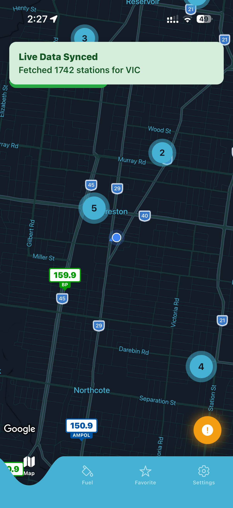
  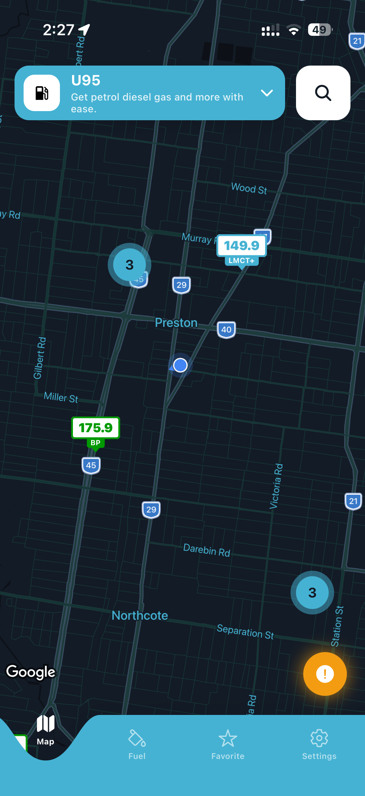
  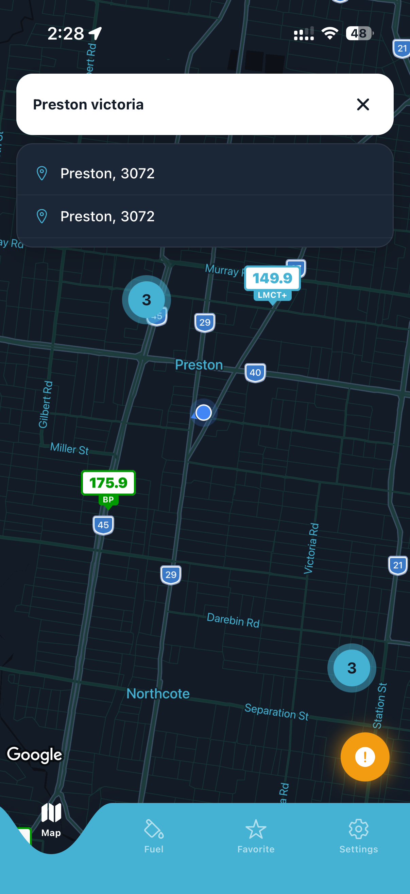
</p>

<p align="center">
  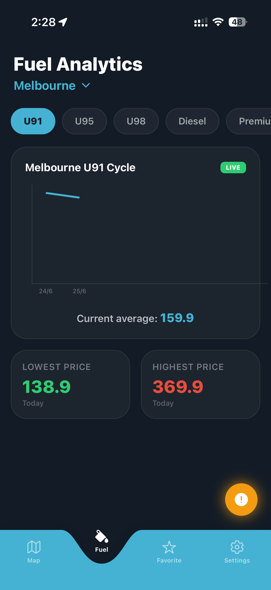
  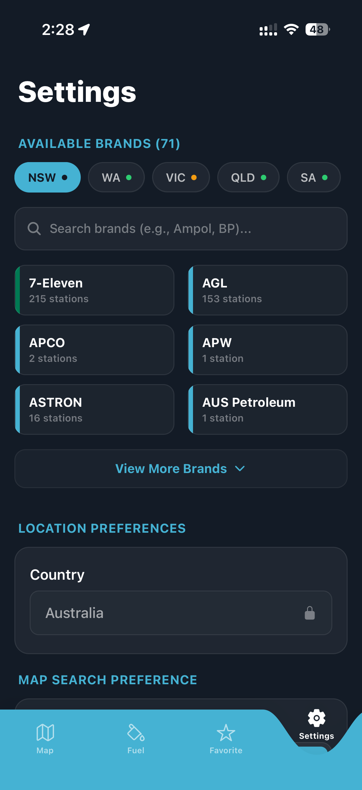
  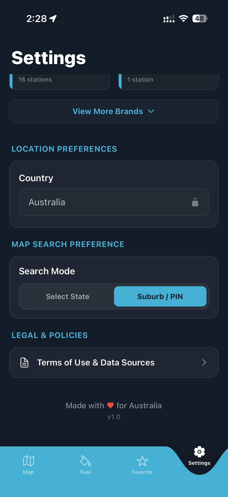
</p>

<p align="center">
  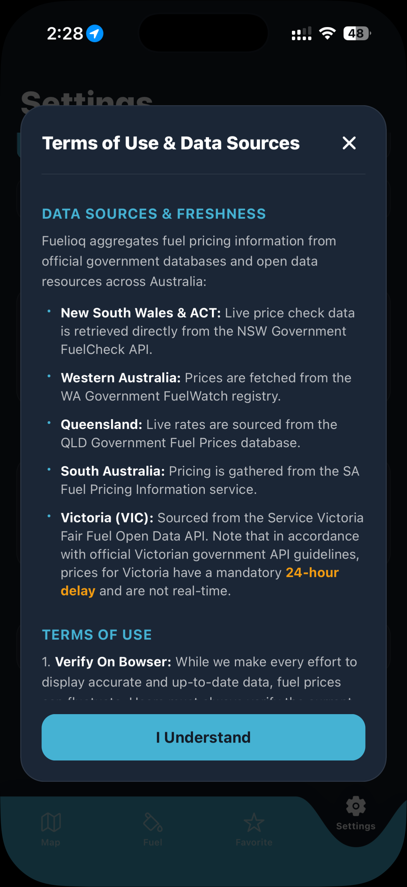
  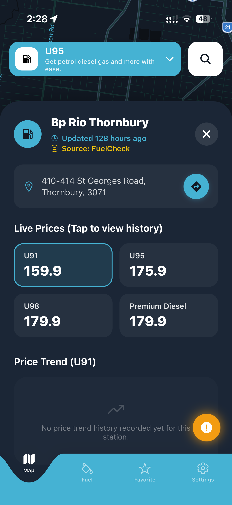
  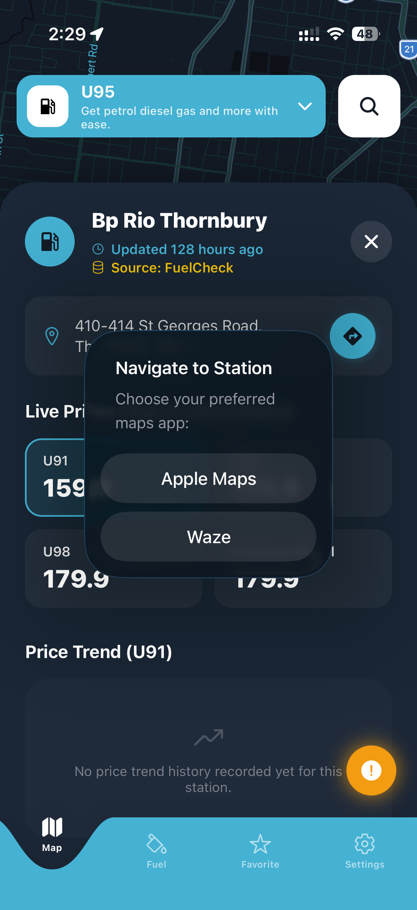
</p>

<p align="center">
  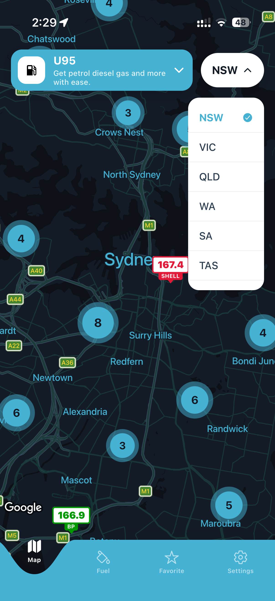
  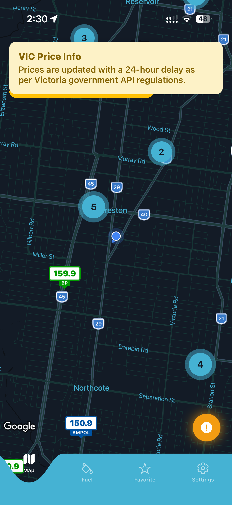
</p>

---

## Tech Stack

- **Framework**: Expo (React Native) with Expo Router for file-based routing.
- **UI Components**: 
  - `@gorhom/bottom-sheet` for smooth station detail panels.
  - `react-native-gifted-charts` for pricing history visualization.
  - `react-native-reanimated` for native micro-animations.
- **Map Integration**: `react-native-maps` & `react-native-map-clustering` for fast marker rendering.
- **Backend & Database**: Supabase for relational data storage, RPC database functions, and Edge Functions.
- **Navigation Routing**: `react-native-map-link` to deep-link users directly to navigation apps.

---

## Getting Started

### Prerequisites

Make sure you have Node.js and the Expo Go app (or simulators) set up on your machine.

### Installation

1. Clone the repository and navigate to the project directory:
   ```bash
   cd Fuelioq
   ```

2. Install the dependencies:
   ```bash
   npm install
   ```

3. Start the local development server:
   ```bash
   npm run start
   ```

   *Press `a` to run on Android, `i` to run on iOS, or scan the QR code on your terminal with the Expo Go app.*

---

## Project Structure

```
├── app/                  # File-based routing (Expo Router)
│   ├── (tabs)/           # Main navigation tabs (Map, Analytics, Favorites, Settings)
│   └── _layout.tsx       # Root layout configuration
├── assets/               # Local images, fonts, and screenshots
├── components/           # Reusable UI elements (Map Markers, Sheets, Cards)
├── constants/            # Color palettes and brand stylings
├── context/              # Global state contexts (e.g. alerts)
├── lib/                  # Helper functions and Supabase clients
└── supabase/             # Supabase Edge Functions and configuration
```

---

## Road Map

- [x] High-performance map with marker clustering
- [x] Price analysis charts with Gifted Charts
- [x] Edge function scrapers for Australian states
- [ ] **Favorites List**: Custom user-saved stations screen (currently a placeholder in the Favorites tab).
